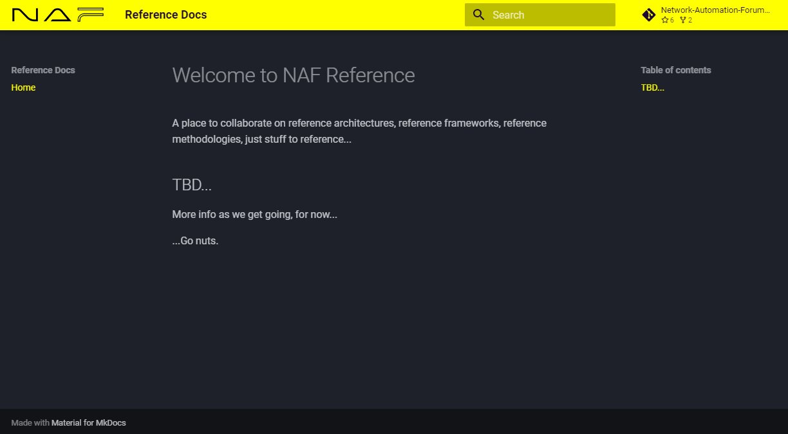

# reference
A place to collaborate on reference architectures, reference frameworks, reference methodologies, just stuff to reference...


## Easily Spin Up the Docs Locally

This is a documentation repo, so there are no runtime dependencies — only the dev toolchain
(mkdocs, mkdocs-material, yamllint) declared in `pyproject.toml`.

1. Install [uv](https://docs.astral.sh/uv/getting-started/installation/).

2. From the root of the repo, install the docs toolchain into a project-local virtualenv:

   ```
   uv sync
   ```

3. Serve the docs locally with live reload:

   ```
   uv run mkdocs serve
   ```

   The site will be available at http://127.0.0.1:8000/ and will reload as you edit.

### Screenshots


