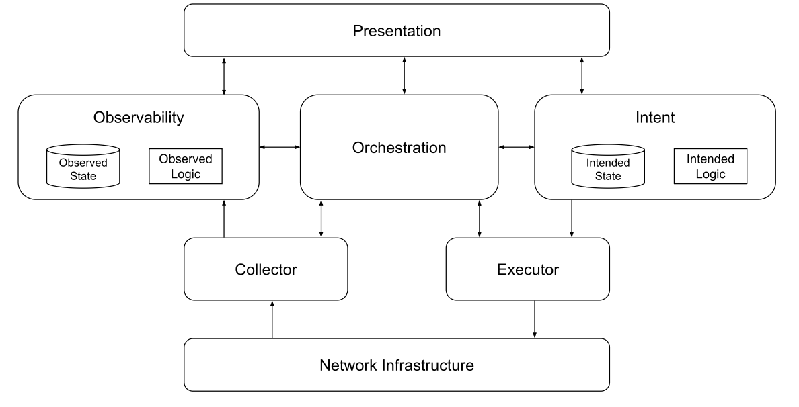

# The Network Automation Architecture by the NAF

This document outlines a modular, vendor-neutral framework for network automation. It defines a high-level reference model comprising key building blocks and functions necessary for designing, implementing, or refining automation strategies. The framework serves both as a starting point for new automation efforts and a guide for evolving existing solutions.

## Context

Network automation encompasses a wide range of use cases and infrastructure types, including on-premises, cloud, and hybrid environments. It covers everything from hardware provisioning and protocol configuration to performance monitoring and policy enforcement.

This architecture defines functional building blocks that can be composed into tools. Rather than starting with specific tools, we advocate designing around required functionalities. Teams can begin with a narrow focus—such as monitoring or automation—and expand over time as needs evolve.

All components SHOULD follow modern software engineering practices, such as version control and CI/CD, and expose machine-friendly APIs (documented via schema). This ensures seamless integration with internal systems and external tooling for security, logging, observability, and traceability.

Moreover, all the blocks MAY be implemented by one or more components as needed. The blocks don’t have to be a single instance; there could be many instances depending on the concrete implementation.

## The architecture

The proposed reference architecture defines six major functional building blocks (besides the actual network infrastructure), each with a clear and distinct purpose to enable straightforward mapping of specific features. While we acknowledge that some areas may overlap or require further refinement, our priority has been to establish a solid foundational understanding.

- Intent: Defines the logic to handle and the persistence layer to store the desired state of the network, including both configuration and operational expectations.
- Observability: It persists the actual network state, and defines the logic to process it.
- Orchestrator: Defines how the automation tasks are coordinated and executed in response to events.
- Executor: Encompasses the actual tasks applied to the network to drive changes (e.g., updating configuration) as guided by the intended state.
- Collector:  In contrast to Executor, this component focuses on retrieving (i.e., reading) the actual state of the network.
- Presentation: Provides the interfaces through which users interact with the system, including dashboards, graphical user interfaces (e.g., ITSM), and CLI tools. 

## Intent

- It MUST be capable of representing, in a structured form, any network-related aspect. This broad scope includes, but is not limited to, data such as IP addressing, data center infrastructure (e.g., racks, cabling), routing protocols, virtualized services, secrets, operational levels (such as maximum CPU), configuration templates or data mappings, and artifacts, as well as service abstraction or policy definitions. 
- The data MUST support create, read, update, and delete operations. 
- Access to this information MUST be exposed through a standardized, well-documented Application Programming Interface (API) (e.g., REST, GraphQL, etc.).
- The modeling SHOULD use a neutral representation that will be derived into vendor-specific configuration artifacts.
- It SHOULD provide a consistent and unified view of the desired state, even when the data is distributed across multiple data sources. 
- In addition to the core network data, it SHOULD include metadata that supports effective data governance, such as timestamps, data origin, data ownership, and valid periods.
- Ideally, these operations SHOULD be transactional, offer custom validation, and provide a versioned access to data.
- It MAY include all the logic related to intended state management, such as data validation, data aggregation or replication, breaking down abstract services into concrete objects, and combining data to generate configuration artifacts.

## Executor

- It MUST be capable of interacting with any of the supported network write interfaces, including SSH, NETCONF, gNMI/gNOI, and REST APIs.
- It SHOULD support any network operation that alters the network state, such as deploying a full or partial configuration artifact or performing device actions like reboots and software updates.
- The task input SHOULD come from the intended state or be derived from it through data originating from the Observability component.
- It SHOULD provide a dry-run operation to check the expected result of the execution without actually executing it.
- It SHOULD support transactional execution of the changes.
- It MAY support both imperative approaches (where the task defines how to operate) and declarative approaches (where the task defines what the desired outcome is, and the system determines how to achieve it). In both cases, the operation SHOULD be idempotent; rerunning it should produce the same result.

## Collector

- It MUST includes capabilities for retrieving live data from the network using read interfaces—similar to the Executor component—but extends support to additional protocols to capture metrics and log, such as SNMP, Syslog, and other data such as flow-based telemetry (e.g., NetFlow, sFlow), packet capturing, traces, and others.
- The data values SHOULD be normalized from different vendors and method specifics.

## Observability

- It MUST support historical data persistence and offer powerful programmatic access to this data—enabling advanced analytics, reporting, and troubleshooting workflows.
- It SHOULD offer a capable query language to extract the data.
- It SHOULD expose relevant insights into the current network state and automatically generate events when discrepancies are detected between the actual state (configuration or operational) and the intended state. These events MAY be processed by humans or connected to the Orchestration block to be automatically processed.
- Retrieved data MAY be enriched with contextual information from the intended state, including other third-party sources (e.g., EoL information, CVEs, maintenance notifications, etc.), enhancing analysis and enabling more accurate data correlation.

## Orchestrator

- It MUST enable the coordination and integration of processes across the various building blocks, allowing the creation of more sophisticated and end-to-end automation workflows. It doesn't directly interact with the network infrastructure.
- Process execution SHOULD follow an event-driven approach, where events can be received synchronously, asynchronously, or generated on a scheduled basis.
- Execution logic SHOULD allow for reverse/compensating actions when a step results in an error or unexpected result, allowing for a controlled rollback. This may be hard to implement due to network infrastructure limitations.
- It SHOULD provide a dry-run operation to check the expected result of the workflow without actually executing it.
- It SHOULD provide the ability to schedule the execution of a workflow on a regular basis or at a given time in the future.
- It SHOULD provide end users with an understanding of the whole automation logging and traceability in the past and current workflows.
- It MAY include logic to correlate multiple events, infer relationships, and determine the appropriate course of action based on the event context.

## Presentation

- It MUST provide robust and flexible authentication and authorization capabilities.
- This component MAY take various forms depending on the needs of the end user, including graphical user interfaces, ITSM, change management systems, messaging platforms, documentation portals, or reporting dashboards.
- It MAY support both read and write interactions, enabling users to view data, initiate tasks, or approve changes.
- It is designed to interface with any of the other building blocks as required, serving as the primary point of contact between humans and the automation system, but this does not imply the need for a single pane of glass.

## Contributors

- Christian Adell
- Ryan Shaw
- Dinesh Dutt
- Claudia de Luna
- Damien Garros
- Wim Henderickx