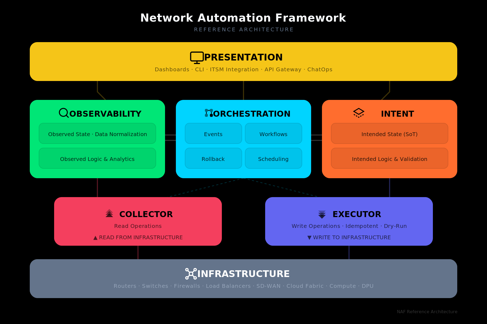
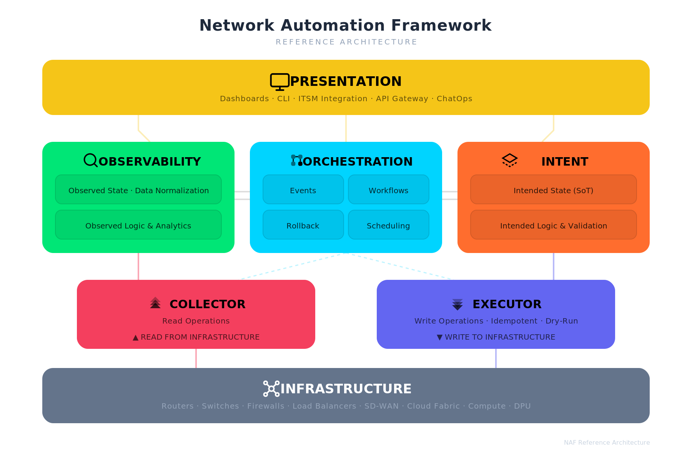
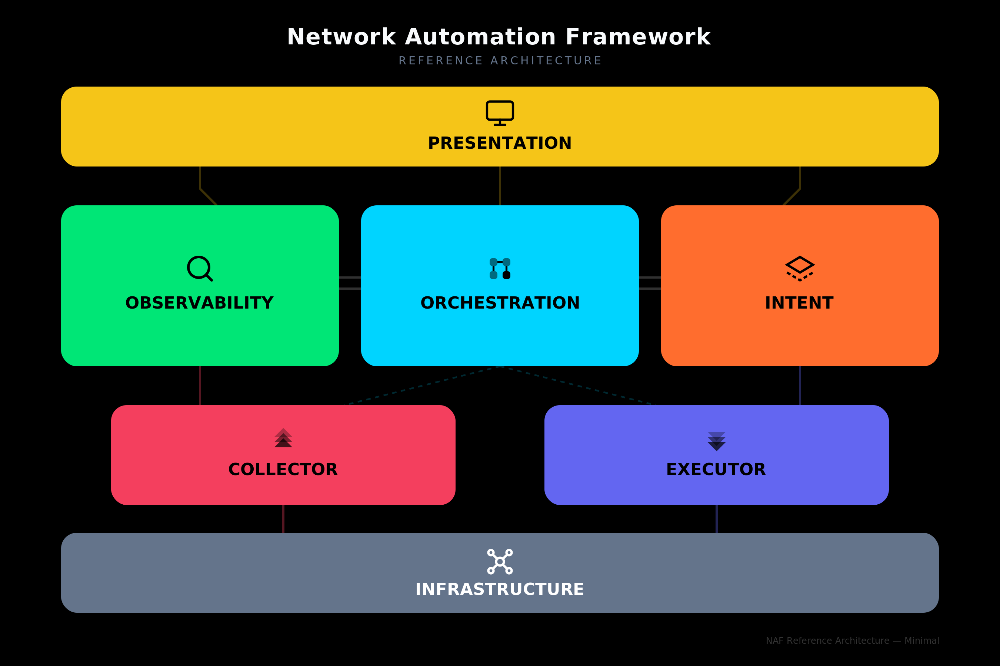
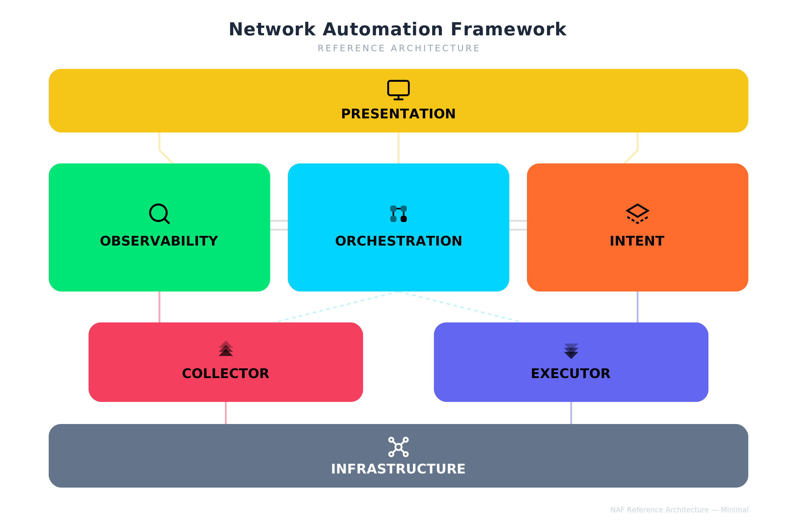
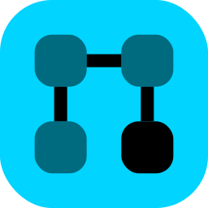

# NAF — Network Automation Framework Brand Guidelines

## 1. Overview

This document defines the visual identity for the Network Automation Framework (NAF). It covers the official color palette, iconography, layout structure, and usage rules for the seven building blocks. A ready-to-use prompt for regenerating the full architecture diagram in SVG is included at the end.

---

## 2. Reference Diagrams

Two diagram styles are available: the **full** variant with detailed sub-labels for each block, and the **minimal** variant that shows only the block titles and icons for use at smaller sizes or in dense layouts. Each style is provided on both dark and light backgrounds.

### Full — Dark Variant



### Full — Light Variant



### Minimal — Dark Variant



### Minimal — Light Variant



---

## 3. Color Palette


Each building block has a dedicated color. All seven blocks use distinct hues for maximum differentiation across contexts.

| Building Block | Color Name | Hex | RGB | Usage Notes |
|---|---|---|---|---|
| **Presentation** | NAF Yellow | `#f5c518` | 245, 197, 24 | Top-level layer. |
| **Observability** | Vivid Green | `#00e676` | 0, 230, 118 | Read-side logic. |
| **Orchestration** | Electric Cyan | `#00d4ff` | 0, 212, 255 | Central coordination. |
| **Intent** | Hot Orange | `#ff6d2e` | 255, 109, 46 | Write-side logic. |
| **Collector** | Rose Red | `#F43F5E` | 244, 63, 94 | Transport layer — read side. |
| **Executor** | Indigo | `#6366F1` | 99, 102, 241 | Transport layer — write side. |
| **Infrastructure** | Slate Gray | `#64748b` | 100, 116, 139 | Bottom layer. Neutral anchor. |

### Background Colors

| Variant | Hex | When to use |
|---|---|---|
| Dark | `#000000` | Presentations on dark slides, hero images, website dark mode |
| Light | `#FFFFFF` | Print, documents, website light mode |

### Text Colors on Blocks

All block titles and sub-labels use **black** (`#000000`) text at varying opacities, except Infrastructure which uses **white** (`#FFFFFF`) text.

| Element | Fill |
|---|---|
| Block title | `#000000` at 100 % |
| Sub-label / description | `#000000` at 67 % (`#000000AA`) |
| Infrastructure title | `#FFFFFF` at 100 % |
| Infrastructure sub-label | `#94A3B8` |

---

## 4. Iconography

Each building block has a dedicated icon drawn in a consistent geometric style at 24×24 px viewBox. Icons use stroke-based or filled paths in black and should be rendered alongside the block name.

### Icon Catalog

#### Presentation — Monitor

A screen with a stand, representing dashboards and user interfaces. Style: Geometric / Line.

| Transparent | Colored |
|:---:|:---:|
|  |  |

#### Observability — Search / Inspect

A magnifying glass representing monitoring, inspection, and data discovery. Style: Geometric / Line.

| Transparent | Colored |
|:---:|:---:|
|  |  |

#### Orchestration — Grid Flow

A 2×2 grid of rounded squares connected by lines, representing workflow coordination. Style: Filled / Bold.

| Transparent | Colored |
|:---:|:---:|
|  |  |

#### Intent — Diamond / Prism

A layered diamond shape representing structured intent definitions and source of truth. Style: Geometric / Line.

| Transparent | Colored |
|:---:|:---:|
|  |  |

#### Collector — Upward Chevrons

Three stacked upward-pointing chevrons at increasing opacity, representing data being pulled up from infrastructure. Style: Filled.

| Transparent | Colored |
|:---:|:---:|
|  |  |

#### Executor — Downward Chevrons

Three stacked downward-pointing chevrons at increasing opacity, representing configuration being pushed down to infrastructure. Style: Filled.

| Transparent | Colored |
|:---:|:---:|
|  |  |

#### Infrastructure — Network Mesh

A central node connected to four corner nodes, representing the network fabric. Style: Geometric / Line.

| Transparent | Colored |
|:---:|:---:|
|  |  |

---

## 5. Layout Structure

The diagram follows a layered architecture read top-to-bottom:

```
┌─────────────────────────────────────────────┐
│               PRESENTATION                   │  ← Full width
└─────────────────────────────────────────────┘
      │                │                │
┌───────────┐  ┌───────────────┐  ┌───────────┐
│OBSERVABILITY│  │ ORCHESTRATION │  │   INTENT  │  ← Three equal columns
└───────────┘  └───────────────┘  └───────────┘
      │           ╱         ╲           │
   ┌──────────┐              ┌──────────┐
   │ COLLECTOR │              │ EXECUTOR │         ← Narrower, centered
   └──────────┘              └──────────┘
      │                              │
┌─────────────────────────────────────────────┐
│              INFRASTRUCTURE                  │  ← Full width
└─────────────────────────────────────────────┘
```

### Layer Mapping

| Layer | Blocks | Role |
|---|---|---|
| User Interface | Presentation | How humans and systems interact with the framework |
| Logic | Observability, Orchestration, Intent | Core automation logic — read, coordinate, write |
| Transport | Collector, Executor | Read from and write to infrastructure |
| Resources | Infrastructure | Physical and virtual network/compute resources |

### Read / Write Symmetry

The left side of the diagram represents the **read path** (Observability → Collector → Infrastructure) and the right side represents the **write path** (Intent → Executor → Infrastructure). Orchestration sits in the center, coordinating both sides.

---

## 6. Sub-block Content

Each logic-layer block contains internal sub-labels:

| Block | Sub-blocks |
|---|---|
| Observability | Observed State · Data Normalization / Observed Logic & Analytics |
| Orchestration | Events · Workflows / Rollback · Scheduling |
| Intent | Intended State (SoT) / Intended Logic & Validation |
| Collector | Read Operations / ▲ READ FROM INFRASTRUCTURE |
| Executor | Write Operations · Idempotent · Dry-Run / ▼ WRITE TO INFRASTRUCTURE |
| Presentation | Dashboards · CLI · ITSM Integration · API Gateway · ChatOps |
| Infrastructure | Routers · Switches · Firewalls · Load Balancers · SD-WAN · Cloud Fabric · Compute · DPU |

---

## 7. Typography

| Element | Font | Size | Weight |
|---|---|---|---|
| Diagram title | Inter (fallback: Helvetica Neue, Arial) | 20 px | 700 (Bold) |
| Subtitle | Inter | 10 px | 400 |
| Block title | Inter | 15–17 px | 700 (Bold) |
| Sub-label | Inter | 10 px | 500 (Medium) |

---

## 8. Prompt — Regenerate Full NAF Architecture Diagram

Copy the prompt below into any LLM that can generate SVG to produce a NAF diagram matching these brand guidelines.

---

### PROMPT START

```
Generate an SVG diagram (viewBox 0 0 900 600) for the Network Automation Framework (NAF) reference architecture. Use font-family "Inter, Helvetica Neue, Arial, sans-serif" throughout.

BACKGROUND: Use a solid rectangle fill. Use #000000 for dark variant or #FFFFFF for light variant.

TITLE: Centered at top. "Network Automation Framework" in 20px bold. Below it, "REFERENCE ARCHITECTURE" in 10px uppercase with letter-spacing 2. On dark background use white (#F8FAFC) title and gray (#64748B) subtitle. On white background use dark (#1E293B) title and light gray (#94A3B8) subtitle.

LAYOUT — 4 horizontal layers, top to bottom:

LAYER 1 — PRESENTATION (full width, ~790px wide, height 72px, rounded corners rx=14):
- Color: #f5c518 (NAF Yellow)
- Icon: Monitor — a rectangle screen (stroke, no fill) with a stand line below it, placed to the left of the title
- Title: "PRESENTATION" in 17px bold black
- Sub-text: "Dashboards · CLI · ITSM Integration · API Gateway · ChatOps" in 10px, black at 60% opacity

LAYER 2 — Three equal-width blocks side by side (each ~250px wide, height 145px, rx=14), with 20px gaps:

Left block — OBSERVABILITY:
- Color: #00e676 (Vivid Green)
- Icon: Magnifying glass (circle + angled line, stroke only), placed inline left of title
- Title: "OBSERVABILITY" in 15px bold black
- Two sub-boxes (rx=8, fill #00000015, stroke #00000020):
  - "Observed State · Data Normalization"
  - "Observed Logic & Analytics"

Center block — ORCHESTRATION:
- Color: #00d4ff (Electric Cyan)
- Icon: 2×2 grid of rounded squares connected by lines (filled), placed inline left of title
- Title: "ORCHESTRATION" in 15px bold black
- Four sub-boxes in a 2×2 grid:
  - Top row: "Events" | "Workflows"
  - Bottom row: "Rollback" | "Scheduling"

Right block — INTENT:
- Color: #ff6d2e (Hot Orange)
- Icon: Layered diamond/prism shape (stroke, dashed lower layer), placed inline left of title
- Title: "INTENT" in 15px bold black
- Two sub-boxes:
  - "Intended State (SoT)"
  - "Intended Logic & Validation"

Add subtle horizontal connector lines between adjacent middle blocks (double lines, semi-transparent).

LAYER 3 — Two narrower blocks (~310px each, height 90px, rx=14), centered under their parent:

Left — COLLECTOR:
- Color: #F43F5E (Rose Red)
- Icon: Three stacked upward chevrons at increasing opacity (0.4, 0.7, 1.0), filled black
- Title: "COLLECTOR" in 15px bold black
- Sub-text: "Read Operations" and "▲ READ FROM INFRASTRUCTURE" in 10px

Right — EXECUTOR:
- Color: #6366F1 (Indigo)
- Icon: Three stacked downward chevrons at increasing opacity (0.4, 0.7, 1.0), filled black
- Title: "EXECUTOR" in 15px bold black
- Sub-text: "Write Operations · Idempotent · Dry-Run" and "▼ WRITE TO INFRASTRUCTURE" in 10px

LAYER 4 — INFRASTRUCTURE (full width, ~790px, height 72px, rx=14):
- Color: #64748b (Slate Gray)
- Icon: Network mesh — central circle connected to 4 corner circles by lines (stroke white), placed to the left of the title
- Title: "INFRASTRUCTURE" in 17px bold white
- Sub-text: "Routers · Switches · Firewalls · Load Balancers · SD-WAN · Cloud Fabric · Compute · DPU" in 10px, #94A3B8

CONNECTORS: Add subtle flow lines between layers using each block's color at 40% opacity. Dashed lines from Orchestration to Collector and Executor. Solid lines from Observability down to Collector and Intent down to Executor.

SHADOW: Apply a subtle drop shadow (dy=4, stdDeviation=6, flood-color #00000018) to all blocks.

Ensure all icons sit inline to the LEFT of their block title text, both vertically centered within the title area. Icons should not overlap with text.
```

### PROMPT END

---

## 9. Prompt — Generate Individual Icon SVGs

Use this prompt to generate standalone icon files for each building block.

### PROMPT START

```
Generate 14 individual SVG icon files for the NAF (Network Automation Framework) building blocks. Each icon should use a 24×24 viewBox. Create two versions of each icon:

TRANSPARENT BACKGROUND VERSION:
- No background rectangle
- Icon strokes/fills in black (#000000)
- Suitable for use on any background

COLORED BACKGROUND VERSION:
- Rounded rectangle background (rx=6) filling the full viewBox, using the block's brand color
- Icon strokes/fills in black (#000000)
- Suitable for standalone use as app icons or badges

Here are the 7 icons and their colors:

1. PRESENTATION (color: #f5c518)
   Monitor icon: <rect x="2" y="3" width="20" height="14" rx="2"/> with stand lines from center bottom to a horizontal base line. Stroke-based, no fill.

2. OBSERVABILITY (color: #00e676)
   Search icon: <circle cx="11" cy="11" r="8"/> with a diagonal line from (16.65,16.65) to (21,21). Stroke-based, no fill.

3. ORCHESTRATION (color: #00d4ff)
   Grid flow icon: Four 6×6 rounded squares at positions (4,4), (14,4), (4,14), (14,14) with rx=2. The bottom-right square is fully opaque, others at 0.5. Connecting lines between them. Filled style.

4. INTENT (color: #ff6d2e)
   Diamond/prism icon: A closed diamond path "M12 3L2 9l10 6 10-6-10-6z" with a dashed lower layer "M2 15l10 6 10-6". Stroke-based, no fill.

5. COLLECTOR (color: #F43F5E)
   Upward chevrons: Three "V" shapes pointing up — "M5 10l7-7 7 7" at opacity 0.4, "M5 14l7-7 7 7" at 0.7, "M5 18l7-7 7 7" at 1.0. Filled black.

6. EXECUTOR (color: #6366F1)
   Downward chevrons: Three inverted "V" shapes pointing down — "M5 6l7 7 7-7" at opacity 0.4, "M5 10l7 7 7-7" at 0.7, "M5 14l7 7 7-7" at 1.0. Filled black.

7. INFRASTRUCTURE (color: #64748b)
   Network mesh: Central circle (cx=12, cy=12, r=3), four corner circles at (5,5), (19,5), (5,19), (19,19) each r=2, connected to center by lines. Stroke-based white (#FFFFFF) for colored version, black for transparent version.
```

### PROMPT END

---

## 10. File Inventory

| File | Description |
|---|---|
| `naf-automation-framework-v1-dark.svg` / `.png` | Full architecture diagram — dark background |
| `naf-automation-framework-v1-white.svg` / `.png` | Full architecture diagram — white background |
| `naf-automation-framework-v1-minimal-dark.svg` / `.png` | Minimal architecture diagram — dark background |
| `naf-automation-framework-v1-minimal-white.svg` / `.png` | Minimal architecture diagram — white background |
| `naf-icon-{block}-transparent.svg` / `.png` | Individual icon, transparent background (×7) |
| `naf-icon-{block}-colored.svg` / `.png` | Individual icon, colored background (×7) |
| `naf-project-icon.svg` / `.png` (64–1024) | Project icon in multiple sizes |
| `naf-sticker.svg` / `.png` (512, 1024) | NAF sticker artwork |
| `naf-brand-guidelines.md` | This document |
| `naf-brand-guidelines.pdf` | PDF version of this document |
