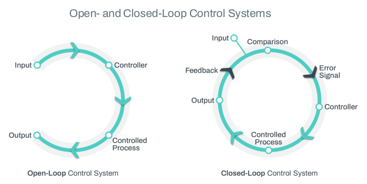

# Feedback

It turns out that automation and orchestration have another thing in common. Both can operate in either an open-loop or a closed-loop fashion (with or without feedback). 

The terms open-loop and closed-loop can apply to various mechanical and/or electronic systems. The most applicable to our purposes here is their use in describing control systems. Strictly speaking, an open-loop control system is one in which the output does not impact the control action of the system. In contrast, a closed-loop control system, as you might have guessed, is one in which the output does impact the control action. Open-loop and closed-loop systems can also be referred to as non-feedback and feedback systems, respectively. 

As you can see in the above diagram, an open-loop (or non-feedback) control system has no feedback loop. The timer function on a clothes dryer is a good example. The input in this case is the time you set after you load up your wet clothes from the washing machine. Once you close the door and hit start, the dryer runs for that amount of time. And then it stops. Whether your clothes are actually dry or not is of no consequence. To restate; the control function is completely independent from the output.

Referring again to the diagram above, you can see that a closed-loop system does have a feedback mechanism. A common example is the thermostat in your home or office. This time the input is your desired temperature. The system then compares the desired temperature to the ambient temperature in the room and any difference is recorded as an error signal, which is then sent to the controller. The controller bases its control action on the error signal received. If the room is too hot, it activates the cooling system, and if the room is too cold, it activates the heating system. When either heating or cooling changes the ambient temperature in the room, this new temperature is compared to the desired temperature (the input), a new error signal is generated, and a new control action is taken. This continues until there is no error (when the room temperature matches the desired temperature). 

A more complex closed loop system can have multiple feedback loops to further refine control. The key observation is that output is fed back into the control system in order to provide more reliable and accurate control. This is how multitudes of industrial and other control systems avoid “fail at scale” and “runaway automation” problems.
