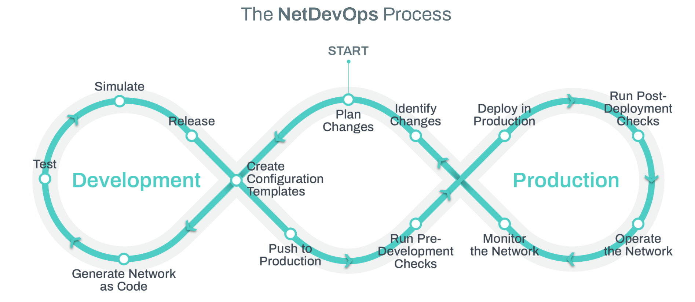

# NetDevOps

NetDevOps is a methodology that applies DevOps practices to networking. DevOps, known for its principles of continuous integration, continuous delivery (CI/CD), Infrastructure as Code (IaC), and the software development life cycle (SDLC), has transformed software development. Now, these principles are being adapted to network operations, bringing efficiency, agility, and automation to the fore.

NetDevOps is how you build and operate an IBN.

## Key Components of a Successful NetDevOps Practice

To build a successful NetDevOps practice, you need more than just a team of smart, hardworking individuals. Here are the essential components:

### 1. Centralized (Off-Device) Datastore(s)

These data stores are often referred to as "Source(s) of Truth"

You know the challenges inherent in managing your network configurations with bits and pieces of information scattered across various devices. It’s chaotic, to say the least. That's why having centralized, off-device sources of truth is crucial. These databases and repositories hold the definitive versions of all network configurations, templates, and specific data.

With centralized sources of truth, you can:

- Ensure consistency across your network.
- Easily track and manage changes.
- Quickly revert to a known good state if something goes wrong.

### 2. Configuration & Validation Engine

Next up is the configuration and Validation engine. This component is responsible for managing the state of your devices and functions. It ensures that configurations are not only applied correctly but also validated against predefined policies and standards.

A robust configuration and validation (aka Orchestration) engine allows you to:

- Automate the deployment of configurations.
- Validate changes before they are rolled out.
- Detect and rectify configuration drift, where actual device states diverge from the intended states.

### 3. Operational Toolkit

Finally, no NetDevOps practice would be complete without a comprehensive operational toolkit. This toolkit includes tools for monitoring, reporting, and troubleshooting your network.

With the right operational tools, you can:

- Go beyond monitoring and provide true Observability.
- Generate detailed reports on network health and performance.
- Quickly identify and resolve issues, minimizing downtime and maintaining optimal network performance.

## Bringing It All Together

Implementing NetDevOps is not just about adopting new tools and practices; it’s about changing the way you think about and manage your network. It requires a cultural shift towards automation, continuous improvement, and collaboration between development and (network) operations teams.

Here’s a quick recap of what you need for a successful NetDevOps practice:

- **The Right Team**: Combine the talents of software developers, systems engineers, and network engineers.
- **Centralized Datastore(s)**: Keep your configurations consistent and easily manageable.
- **Configuration & Validation Engine**: Automate and validate your network configuration changes.
- **Operational Toolkit**: Monitor, report, and troubleshoot effectively.

By embracing NetDevOps, you can transform your network operations, making them more efficient, reliable, and scalable. It's time to take the leap and bring the power of DevOps to your networking domain.

- [Back: Intent Based Networking (IBN)](IBN.md)