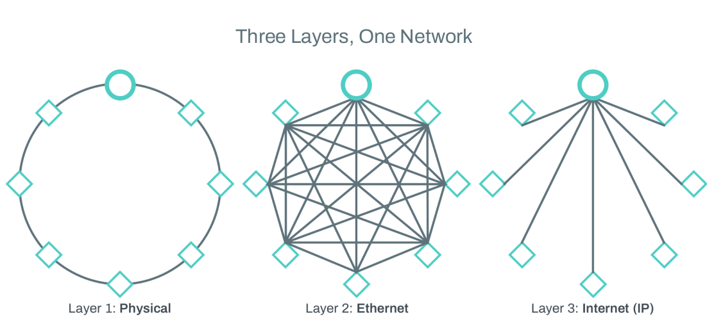

# Network Virtualization

Network virtualization is one of those topics that can seem very complicated when we encounter it out of context, but is actually well understood and even mundane to most network engineers. Network virtualization is the act of using tunnels to build overlay networks with topologies that are independent of the underlay network. As stated, it sounds intimidating. So we’ll take a couple examples to demystify that definition. 

Let’s start with the obvious; VLANs. VLAN stands for Virtual Local Area Network. That’s right, if you have configured a VLAN then you have created a virtual network. It’s worth going a bit further down the rabbit hole though, because in reality almost all networks are virtual networks.

Think about the OSI model. While it is not a perfect representation of how systems actually work, there are some fundamental truths included within it. We do build networks in layers, even if we don’t always think about it that way. And what’s more, each of these layers builds upon the one below it by adding encapsulation, aka tunneling.

Consider the three figures in the diagram above. On the left we illustrate the physical connectivity of 8 nodes connected one to another in a ring. The middle figure illustrates the same network, but now shows the any-to-any mesh connectivity at the Ethernet layer. And remember that Ethernet is an encapsulation, adding a header to data to create frames. Finally on the right is an illustration of the IP (internet protocol) connectivity from all nodes to the single router - our network’s default gateway. Here again, the difference between “layer 2” and “layer 3” is manifest in the IP header that turns frames into packets.

This is a simplified example. Still, you should be able to extrapolate its lesson out into real world networks. Consider the classic three tier architecture of a campus network, with switches physically located in IDFs and MDFs throughout a building, or even multiple buildings. And “above” that we can overlay an Ethernet network divided by VLANs to contain each department’s data - multiple meshes riding over the physically hierarchical topology. And at the IP layer, those individual meshes are revealed to be hub and spoke networks, often tied to the same gateway router.

Of course this is true not just for LANs, but also for WANs, MANs, WLANs, and essentially every computer network ever built. And it’s not limited to MAC/PHY, Ethernet, and IP either. We can easily add in new layers, new encapsulations, and therefore new overlays and underlays (overlay just means the top layer being considered and underlay the layer beneath it - most underlays are also overlays, etc.). Using MPLS, VXLAN, or GRE to create tunnels are all methods of network virtualization. The key point is that through creating a virtual network overlay you can build any arbitrary network topology over the top of any other.

This is important for many reasons. Chief among them is that it allows you to optimize each layer, each virtual network, for its specific purpose. At the physical layer we can build a network with the right capacity and latency where the most, or the most important traffic actually flows. At the Ethernet layer we can use VLANs to segregate traffic for storm-control, security, and privacy purposes; with broadcast traffic freely permitted inside those boundaries. And at the IP layer we can stitch these VLANs back together through specific traffic inspection points, while also connecting them to other, more far flung destinations by designing for optimal routing paths.

When you combine network automation with network virtualization we open up new possibilities. Because virtual networks are created entirely in code (configuration) and leverage pre-existing physical connectivity; they can be turned up and turned down rapidly. And because automation and orchestration can make complicated and complex operations easier and simpler; they allow manipulation of virtual networks on a scope, scale, and speed far beyond what human operators can. Imagine a network that automatically provisions and de-provisions virtual links as they are needed and discarded by employees, customers, sensors, and applications. This is possible - and we’ll show you how.
